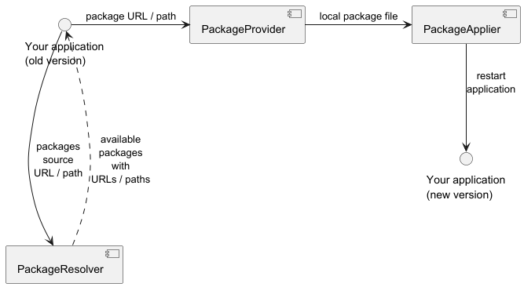

<!-- Logo and description -->

    
    <!--h3 align="center">...because Java desktop development isn't dead</h3-->

<!-- Badges -->
 

    
    
    
    
    
    

<h2></h2>

    

__Upme__ is a simple library to add self-update capabilities to Java desktop applications. Its main goals are ease of use, extensibility and robustness.
While the diagram above shows a common, but very simple use-case, the library also provides more low-level control.

## Features
- [ ] high-level wrapper for the average use-case of updating to the latest version
- [ ] archive-based full-replacement updates
- [ ] configure which files to preserve during update
- [ ] restarting after update
- [ ] rollback on error
- [ ] create log file
- [ ] clean up temporary files
- [ ] automatically elevate permissions permissions if needed
- [ ] select desired new version out of a list of available updates
- [ ] fetch updates from custom web server
- [ ] fetch updates from Github Releases
- [ ] support multiple download links for a single update
- [ ] support for platform-specific updates

<!--## Getting started-->
<!-- How to use Upme in your project, with code snippets -->

<!-- ## Example project -->
<!-- link a separate repository as a working example -->

<!--
## How it works
Upme breaks the update process down into three stages. The diagram below illustrates the high-level architecture:
 
-->

<!--
## Contributing
Contributions of all forms are welcome. If you are not sure about something, open an issue first or comment on an existing one, if applicable. Feel free to submit a pull request as soon as you are ready.
Thank you.
-->
